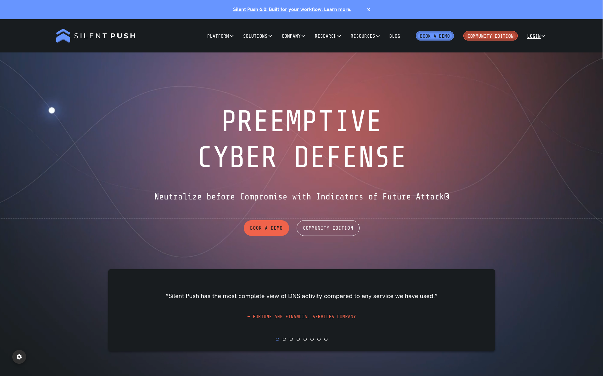
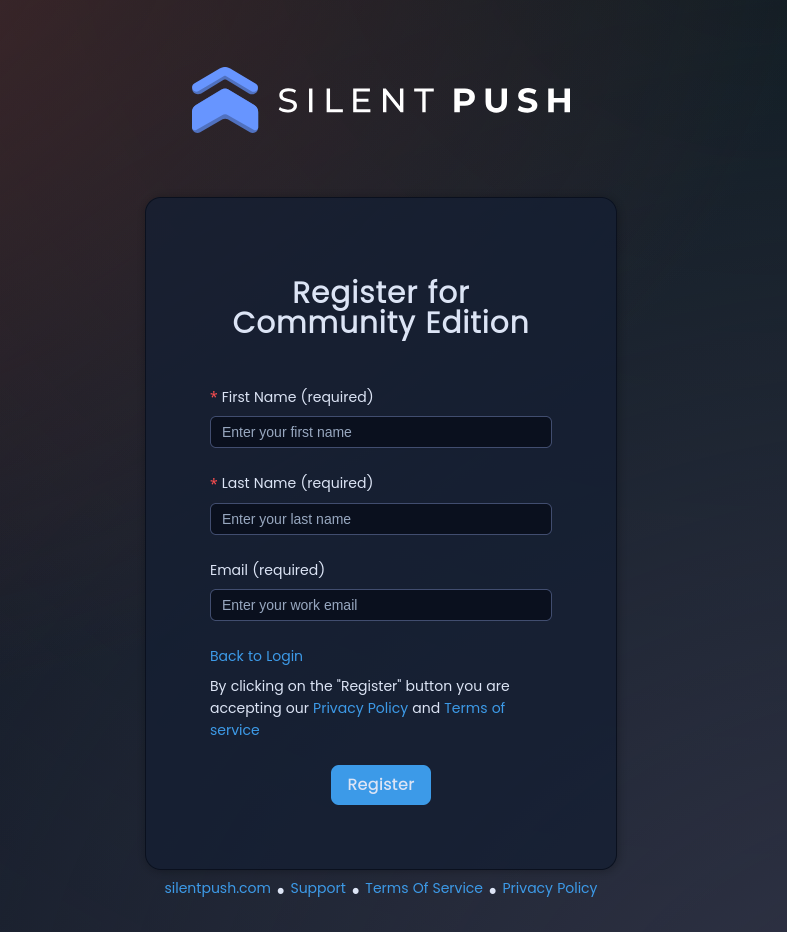
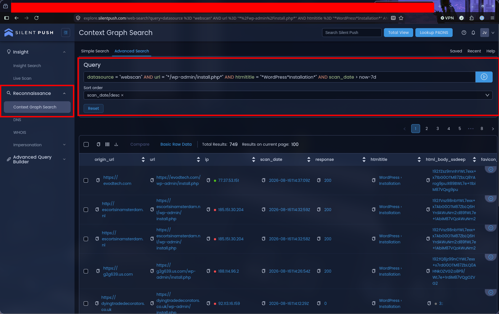
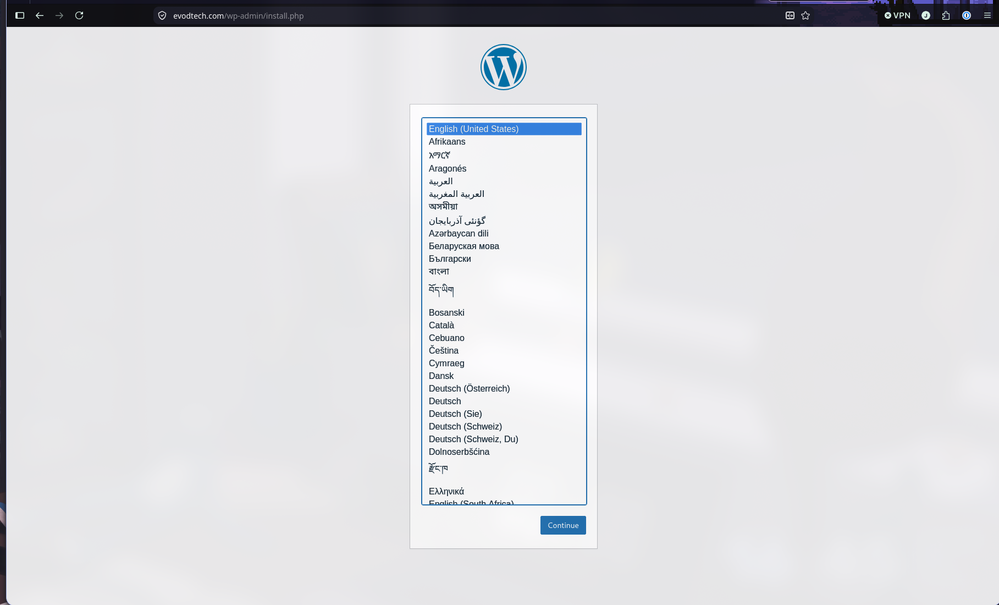
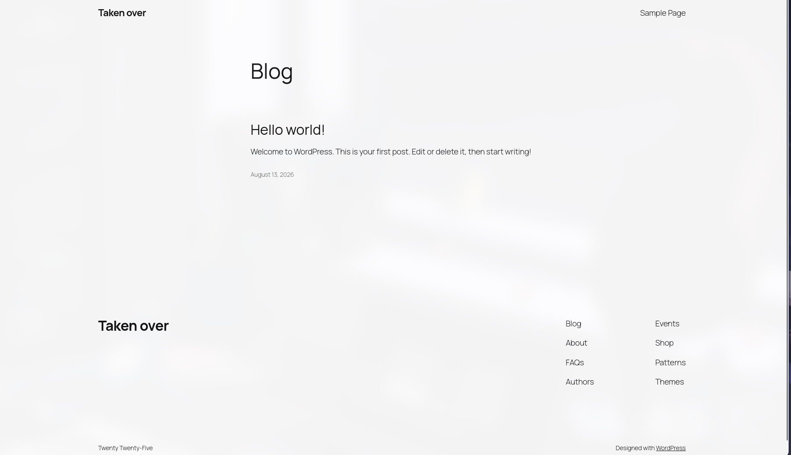

<h1 align="center">How to find and takeover unconfigured wordpress sites</h1>

<p align="center">
  <strong>Written by <a href="https://github.com/jvr2022">@jvr2022</a> on GitHub</strong>
</p>

<p align="center">
  <a href="https://github.com/jvr2022"></a>
  <a href="https://x.com/joshuabuilds_"></a>
  <a href="https://bugcrowd.com/h/joshuavanrijswijk"></a>
  <a href="https://discord.gg/bugbounty"></a>
</p>

> If this guide helps, please drop a ⭐ on the repository and join the [Bounty Hunters Discord](https://discord.gg/bugbounty).

> [!WARNING]
> Only use this on systems you own or are explicitly allowed to test. Silent Push can show live websites, and a search result is not permission. Do not create a WordPress account or submit the installer on a live site unless the program explicitly allows it. Use a local lab or an approved staging site for the setup part. Unauthorized access can cause real damage and lead to criminal charges, including jail time. The author and the Bounty Hunters community are not responsible for misuse or damage caused by this material.

## Why this page matters

When I am looking for this kind of issue, I am not trying to break into random WordPress sites. I am looking for a forgotten installation.

WordPress starts its setup process at `/wp-admin/install.php`. If that page is still sitting on a public host, there is a chance somebody uploaded WordPress and never finished the deployment. That is a useful lead for a bug bounty report.

## What Silent Push actually does

If you have never used Silent Push before, think of it as a search engine for threat intelligence and internet infrastructure. It keeps observations about public websites, including URLs, HTML titles, response codes, headers, server banners, favicons, certificates, and scan times.

That is useful here because you can search a large collection of web observations without having to build your own crawler. It is also the bit people sometimes forget: the results are observations, not a live guarantee. A page Silent Push saw last week may be gone today, so I treat every result as a starting point.

Silent Push calls its query language SPQL. It is just text with fields, operators, wildcards, and date filters. The [SPQL documentation](https://help.silentpush.com/docs/spql) is useful if you want to build more complicated searches later.

## Creating an account

You do not need the API for this walkthrough. The normal web interface is enough.

Go to [Silent Push](https://www.silentpush.com/), choose **Community Edition**, and click **Sign Up**.

<p align="center">
  
</p>

Fill in the form and choose **Register**.

<p align="center">
  
</p>

Silent Push will send a confirmation email. Open it, follow the link, choose **Set Password**, and finish the setup. Their current account guide says the confirmation link is valid for 72 hours.

Once that is done, return to the portal and log in with the same email address and the password you just created. The names of buttons may move around when the platform changes, so do not worry if your screen is a little different from the screenshots in this article. The current [account setup guide](https://help.silentpush.com/docs/account-setup-and-login) is the best place to check if the signup flow has changed.

## Finding Web Search

After logging in, open the menu on the left and look for **Reconnaissance**. Silent Push currently uses both **Web Search** and **Context Graph Search** in its documentation. If you see either one, open it and look for the query page.

You will usually see a Simple Search and an Advanced Search option. Simple Search is the form where you pick fields from dropdowns. For this article, use **Advanced Search**, click **New** if necessary, and paste the query directly.

If the page asks you to choose a data source, select Web Scan. The query includes the data source as well, so it should be obvious when you have the right screen open.

## Running the search

Paste this into the Advanced Search box:

```text
datasource = "webscan" AND url = "*/wp-admin/install.php*" AND htmltitle = "*WordPress*Installation*" AND scan_date > now-7d
```

The first part, `datasource = "webscan"`, tells Silent Push which collection to search. The URL part looks for the normal WordPress installer path. The asterisks are wildcards, which is why it can find the path at the root of a domain or inside a subdirectory.

The title filter looks for pages whose HTML title contains `WordPress` and `Installation`. It is a helpful filter, not a perfect fingerprint. A different language, a different WordPress version, or a custom hosting page can all produce a different title.

Finally, `scan_date > now-7d` keeps the first search focused on recent observations. Press Enter or click the blue search arrow and wait for the results to load.

<p align="center">
  
</p>

If the search returns nothing, that does not prove there are no unfinished installs. It only means that this exact combination of URL, title, and date filters did not match the data available to your account.

## Reading the results without getting yourself into trouble

When the results appear, resist the temptation to open the first interesting-looking domain. Start with scope.

Check each result against the program rules or the written permission you have. Remove anything that is not explicitly allowed before making a request to it. For the results that are in scope, expand the scan record and note the exact URL, response status, HTML title, and scan date. Silent Push stores historical observations, so the date matters. A record from last week is not proof that the same page is still there today.

<p align="center">
  
</p>s

## When the program authorizes completion

If the program explicitly allows you to complete the installer, or requires it as proof, follow the written rules and do only the minimum necessary action. Use a researcher-controlled, disposable account and put only your researcher name or alias on the site.

<p align="center">
  
</p>

## Using a wider time range

The seven-day search is a good place to start because it keeps the results fairly fresh. If you want to look further back, replace the date condition with:

```text
scan_date > now-30d
```

You can also paste the full query again and replace `now-7d` with `now-30d`. A wider search gives you more results, but it also gives you more stale ones. Recheck anything you plan to report.

## What the site owner should fix

If the site is meant to be live, the owner should finish the WordPress installation and check that the public site no longer presents the unfinished setup flow. If the deployment was abandoned, removing the unused files or taking the host offline is safer than leaving them online.

If you want to dig deeper, these are the pages I used while putting this together:

- [Silent Push account setup and login](https://help.silentpush.com/docs/account-setup-and-login)
- [How to build queries in Context Graph Search](https://help.silentpush.com/docs/how-to-build-queries-in-context-graph-search)
- [How to use Web Search](https://help.silentpush.com/docs/how-to-use-web-search)
- [SPQL query examples](https://help.silentpush.com/docs/query-examples)
- [SPQL data fields](https://help.silentpush.com/docs/spql-data-fields)

---

This article is sponsored by the Bounty Hunters community. If you want to
learn bug bounty hunting, join us at [discord.gg/bugbounty](https://discord.gg/bugbounty).

<p align="center">
  
</p>
